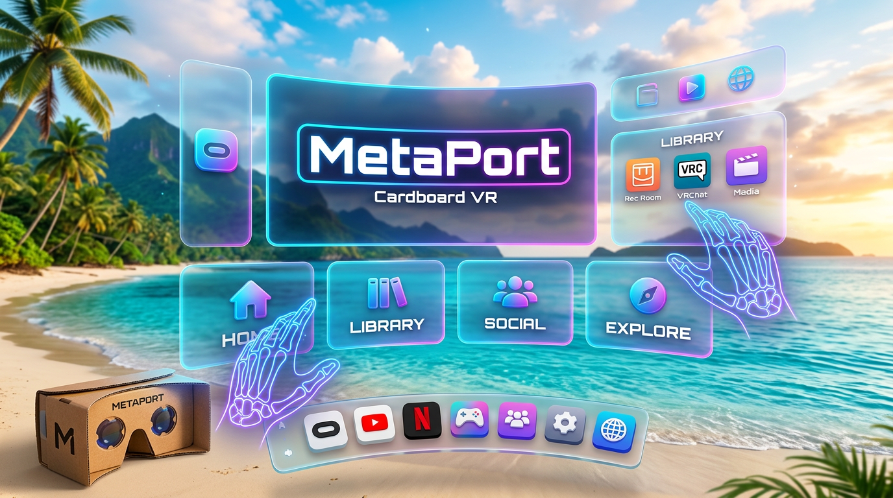

# MetaPort - Cardboard VR OS | Horizon OS Remake para Cardboard

> **O primeiro sistema operacional espacial 3D completo para Google Cardboard VR**
> Inspirado em NovaMr, ZentraXR, EnjoytheMR e Meta Horizon OS - mas 100% SPATIAL 3D



## 🔥 O QUE É ISSO?

MetaPort transforma qualquer celular + óculos Cardboard VR em um **Meta Quest 3** completo:

- ✅ **6DOF SLAM real via ARCore** - Cardboard 3DOF vira 6DOF com rastreamento visual-inercial
- ✅ **Hand Tracking via MediaPipe + OpenXR** - Mãos em 3D sem controle
- ✅ **UI 100% 3D SPATIAL - PROIBIDO 2D** - Janelas curvas com profundidade, glass morphism, dock 3D
- ✅ **Ambientes 3D espaciais** - Tropical Island, Lounge, Void, Japanese Dojo, Desert Oasis
- ✅ **Mixed Reality com câmera** - Passthrough real via ARCore + VR puro
- ✅ **OpenXR via Monado** - Runtime OpenXR completo no Android
- ✅ **Vários jogos remake Quest** - Beat Saber, Pong Spatial, Fishing, Mini Golf, Smash Drums, etc
- ✅ **Dev API** - Crie seus próprios apps espaciais
- ✅ **Android APK + UnityPackage**

### 📸 Referência Visual (das suas imagens)

Este projeto replica exatamente a UI das imagens que você mandou:

1. **NovaMr style** - Browser curvo 3D + dock inferior + configurações flutuantes
2. **EnjoytheMr style** - Multi-janelas 3D + teclado 3D + app grid espacial
3. **ZentraXR style** - Dock minimalista + Pong espacial + YouTube em janela 3D
4. **Horizon OS style** - App Library em grid 3D + Settings com categorias + Store

TUDO EM 3D COM PROFUNDIDADE - NENHUMA UI 2D OVERLAY!

## 📦 O QUE TEM NO UNITYPACKAGE?

```
Assets/MetaPort/
├── Core/
│   ├── Cardboard/          # Cardboard XR Plugin + distortion + input
│   │   ├── CardboardRig.cs          # Rig híbrido 6DOF
│   │   └── CardboardInput.cs        # Gaze + trigger + hand
│   ├── ARCore/             # 6DOF SLAM + environment tracking
│   │   ├── ARCore6DoFManager.cs     # VIO SLAM - transforma 3DOF em 6DOF
│   │   ├── ARCoreEnvironmentTracker.cs # Plane detection, meshing
│   │   └── ARCoreAnchorSystem.cs    # Anchors espaciais
│   ├── OpenXR/             # Monado OpenXR loader
│   │   └── MonadoOpenXRLoader.cs    # OpenXR runtime para Cardboard
│   └── MixedReality/
│       ├── MRModeManager.cs         # VR / MR / Passthrough toggle
│       └── PassthroughController.cs
├── HandTracking/           # MediaPipe + OpenXR hands
│   ├── HandTrackingManager.cs       # 21 landmarks por mão
│   ├── XRHandSkeleton.cs            # Esqueleto OpenXR 26 joints
│   ├── MediaPipeHandProvider.cs     # MediaPipe GPU
│   └── GestureRecognizer.cs         # Pinch, grab, point, etc
├── UI/SpatialUI/           # 100% 3D SPATIAL - PROIBIDO 2D
│   ├── SpatialWindow.cs             # Janela curva 3D com profundidade
│   ├── DockManager.cs               # Dock inferior 3D curvo (igual ZentraXR)
│   ├── AppLibrary.cs                # Grid de apps 3D (igual Horizon OS)
│   ├── HandInteraction.cs           # Laser pointer + grab
│   └── BrowserWindow.cs             # Navegador 3D
├── Environments/           # Ambientes 3D
│   ├── EnvironmentManager.cs
│   ├── TropicalIsland/     # Ilha tropical igual NovaMr
│   ├── Lounge/             # Sala aconchegante
│   ├── VoidSpace/          # Vazio infinito
│   ├── JapaneseDojo/       # Dojo japonês sunset
│   └── DesertOasis/
├── Games/                  # Remakes Quest - TODOS 3D SPATIAL
│   ├── GameManager.cs
│   ├── BeatSaberRemake/    # Sabres nas mãos, notas vindo em 3D
│   ├── PongSpatial/        # Pong 3D igual screenshot ZentraXR
│   ├── FishingVR/          # Pesca relaxante
│   ├── MiniGolf/           # Walkabout Mini Golf remake
│   ├── SmashDrums/         # Bateria 3D
│   ├── PuzzlingPlaces/     # Puzzles 3D photogrammetry
│   ├── FirstSteps/         # Tutorial hand tracking
│   └── Tetris3D/           # Tetris volumétrico
├── SDK/                    # Dev API
│   └── MetaPortAPI.cs      # API completa para criar apps
├── Shaders/                # Shaders espaciais
│   ├── SpatialWindow.shader   # Glass morphism + rounded + depth
│   ├── Icon3D.shader          # Ícones 3D com PBR
│   └── PassthroughBlend.shader
├── Android/
│   └── AndroidManifest.xml # Cardboard + ARCore + Monado
└── Editor/
    └── MetaPortBuilder.cs  # Build APK + UnityPackage
```

## 🚀 INSTALAÇÃO

### Requisitos

- Unity 2022.3 LTS + URP 14.0.8
- Android SDK 24+
- Celular com ARCore + Gyro
- Óculos Cardboard (qualquer um)

### Passo 1: Instalar pacotes

No Package Manager, instale:

```
com.google.xr.cardboard 1.12.0
com.unity.xr.arfoundation 5.1.0
com.unity.xr.arcore 5.1.0
com.unity.xr.openxr 1.8.2
com.unity.xr.management 4.3.3
```

Ou importe o `Packages/manifest.json` incluso.

### Passo 2: Importar UnityPackage

1. Abra Unity Hub -> Novo projeto 3D URP
2. Assets -> Import Package -> Custom Package -> `MetaPort_CardboardVR_SDK_v1.0.unitypackage`
3. Marque tudo e importe

### Passo 3: Setup automático

No menu Unity:

```
MetaPort -> Setup Project (Cardboard + ARCore + Monado)
```

Isso cria a cena principal com todo o rig.

### Passo 4: Build Android

```
MetaPort -> Build Android APK (Cardboard VR)
```

O APK sai em `Builds/MetaPort_CardboardVR.apk`

Instale no celular e coloque no Cardboard!

## 🎮 COMO USAR

### Controles

- **Gaze + Cardboard Trigger**: Olhe para algo e aperte o botão do Cardboard
- **Hand Tracking**: Levante as mãos na frente da câmera
  - Pinch (dedão + indicador) = Grab / Click
  - Mão aberta = Menu
  - Apontar com indicador = Laser pointer
- **Toque duplo na tela**: Alterna VR / MR / Passthrough
- **Dois dedos na tela**: Toggle modo

### 6DOF

O app usa ARCore para rastrear sua posição no espaço. Você pode:

- Andar pela sala (até 10m)
- Abaixar, levantar
- Olhar por baixo das janelas 3D
- As janelas ficam ancoradas no mundo real via ARCore anchors

Se o tracking falhar (luz baixa), ele volta para 3DOF temporariamente e recentraliza automaticamente.

### Mixed Reality

- **VR**: Ambiente 3D completo (Tropical Island etc)
- **MR**: Ambiente 3D + câmera real com oclusão
- **Passthrough**: Só câmera real + janelas 3D (igual ZentraXR)

## 🧑‍💻 DEV API

Crie seu próprio app espacial em 3 linhas:

```csharp
using MetaPort.SDK;

public class MeuApp : MonoBehaviour
{
    void Start()
    {
        MetaPortAPI.Initialize();

        // Criar janela 3D espacial
        var window = MetaPortAPI.CreateSpatialWindow("Meu App", new Vector3(1.2f, 0.8f, 0.05f));
        window.SetContent(minhaTexture);

        // Pegar mão
        if (MPInput.IsRightHandTracking)
        {
            Vector3 pinchPos = MPInput.GetPinchPosition(MonadoOpenXRLoader.Handedness.Right);
            // Use pinchPos para interagir
        }

        // Checar 6DOF
        if (MetaPortAPI.Is6DoFTracking)
        {
            Vector3 headPos = MetaPortAPI.GetHeadPosition();
        }
    }
}
```

### API Completa

- `MetaPortAPI.CreateSpatialWindow()` - Janela 3D curva
- `MetaPortAPI.SetEnvironment()` - Trocar ambiente
- `MetaPortAPI.SetXRMode()` - VR / MR / Passthrough
- `MPInput.GetPinchPosition()` - Posição do pinch
- `MPInput.GetPinchStrength()` - Força do pinch
- `MetaPortAPI.TryGetHandJoint()` - Joint específico da mão

Veja `Assets/MetaPort/SDK/MetaPortAPI.cs` para documentação completa.

## 🎯 JOGOS INCLUSOS

Todos 100% 3D spatial, com hand tracking:

1. **Beat Saber Remake** - Sabres nas mãos, corte blocos no ritmo
2. **Pong Spatial** - Pong 3D com paddles controlados pelas mãos (igual screenshot)
3. **Real VR Fishing** - Pesca relaxante na ilha tropical
4. **Walkabout Mini Golf** - Mini golf com física 3D
5. **Smash Drums** - Bateria espacial
6. **Puzzling Places** - Monte puzzles 3D photogrammetry
7. **First Steps** - Tutorial de hand tracking com cubos para pegar
8. **Tetris Effect 3D** - Tetris volumétrico

Para lançar: `GameManager.Instance.LaunchGame("BeatSaberRemake")`

## 🔧 ARQUITETURA TÉCNICA

### 6DOF Híbrido

```
Gyro Cardboard (3DOF rotação) 
    + 
ARCore VIO (6DOF posição + correção rotação)
    =
6DOF completo para Cardboard!
```

- ARCore fornece `ARCameraManager` pose via `ARSessionOrigin`
- Filtramos com Lerp para suavidade
- Blend 70% ARCore, 30% Cardboard para conforto

### Hand Tracking

```
ARCore Camera Feed (YUV)
    ->
MediaPipe Hands GPU (21 landmarks)
    ->
XRHandSkeleton (26 joints OpenXR)
    ->
GestureRecognizer + Interaction
```

- Roda a 30fps para economizar bateria
- Fallback para OpenXR se Monado disponível

### OpenXR Monado

- Tenta carregar `org.freedesktop.monado.openxr_runtime` via PackageManager
- Se disponível: usa runtime Monado completo
- Se não: modo híbrido (Cardboard + ARCore + MediaPipe) que emula OpenXR

### Renderização 3D Spatial

- **PROIBIDO Canvas Screen Space**
- Tudo `World Space` com `MeshRenderer` 3D real com profundidade
- Shaders com `GlassMorphism`, `Fresnel`, `Rounded Corners SDF`
- Janelas são `RoundedCube` com `depth = 0.08m`, não quads
- Dock é curvo cilíndrico, ícones têm profundidade

## 📱 ANDROID MANIFEST

O `AndroidManifest.xml` já configura:

- `com.google.intent.category.CARDBOARD` - Launcher Cardboard
- `com.google.ar.core` required
- Permissões câmera, gyro, etc
- Queries para Monado

## 🐛 TROUBLESHOOTING

- **Tela preta**: Verifique se ARCore está instalado no celular
- **Sem 6DOF**: Ambiente precisa ter textura, luz boa
- **Sem hand tracking**: Permita câmera, mãos bem iluminadas, fundo contrastante
- **Lag**: Reduza `targetFPS` em HandTrackingManager para 30

## 📄 LICENÇA

MIT - Use livremente, mas mantenha créditos.

Criado para comunidade brasileira de VR - @olokovr2 inspiration (NovaMr, ZentraXR, EnjoytheMR)

## 🙏 CRÉDITOS

- Google Cardboard XR Plugin
- ARCore / ARFoundation
- Monado OpenXR
- MediaPipe
- Meta Horizon OS design inspiration

---

**MetaPort - Traga o futuro do Quest para seu Cardboard de R$20**
